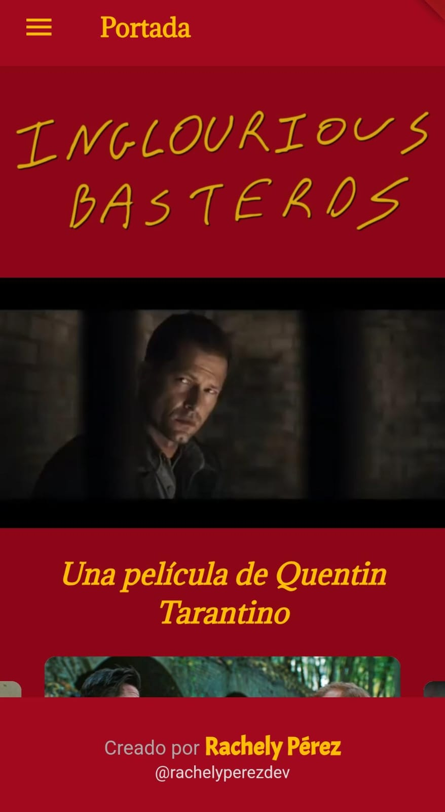
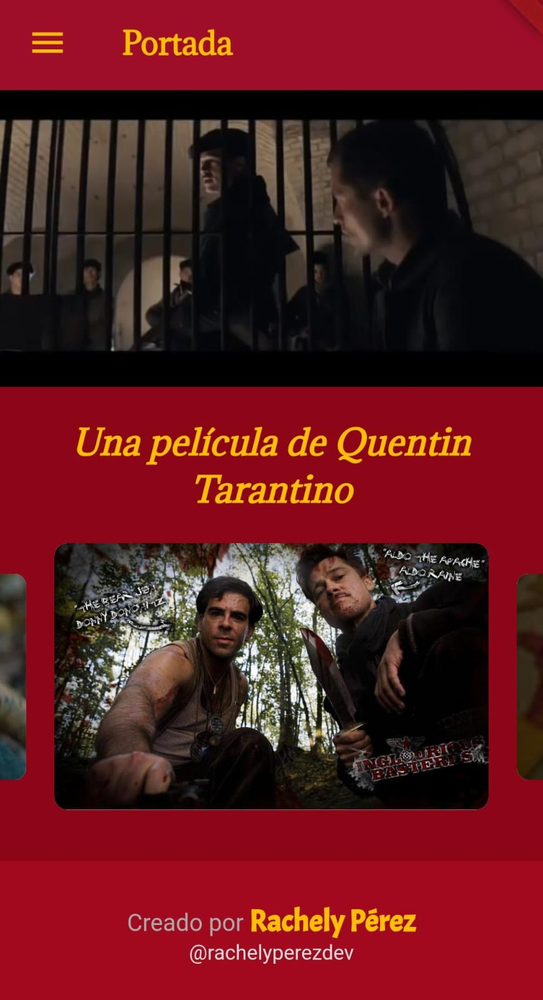
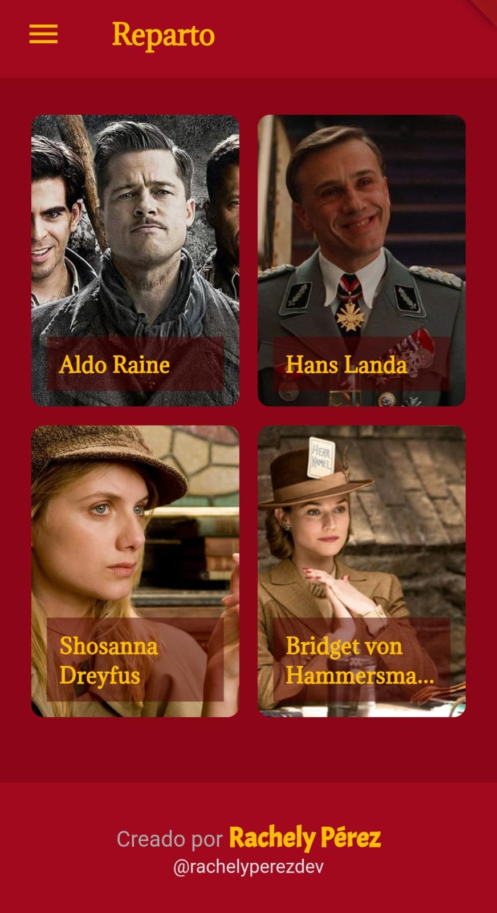
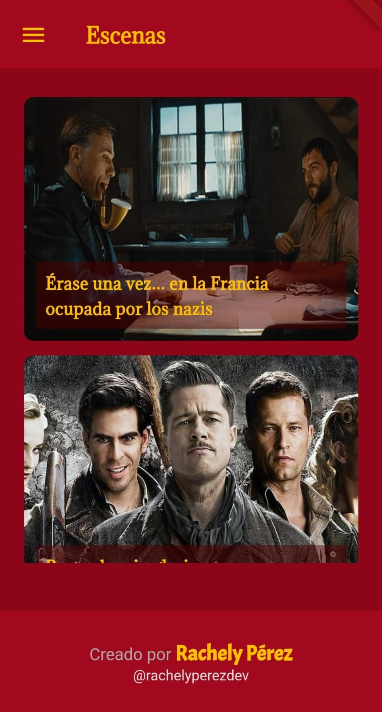
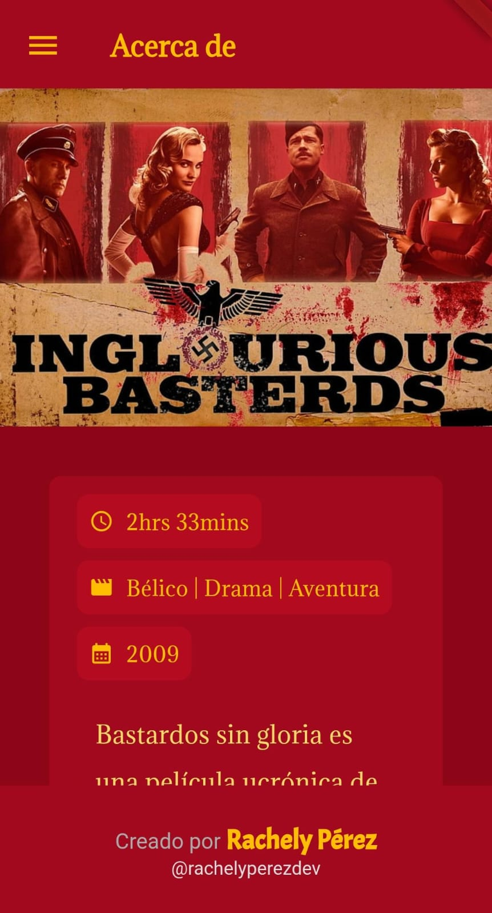
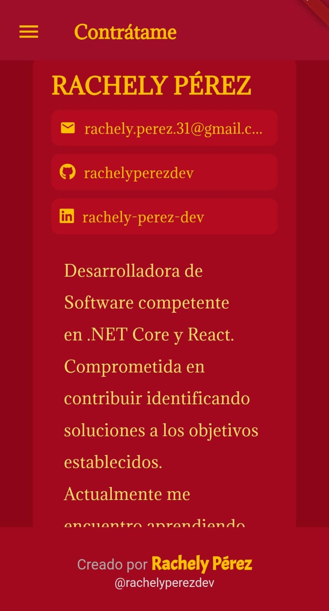

# Inglorious Basterds App

## Overview
This mobile application is dedicated to the movie *Inglorious Basterds*. It provides an engaging and interactive experience for fans, featuring detailed information about characters, memorable moments, and more.

## Features
- **Home Screen**: Includes an original slider and, a introductory video.
- **Characters**: Displays an image and names of four characters. Clicking on a character shows their photo and details.
- **Moments**: Showcases my favorite moments with photos and titles. Selecting a moment reveals more details and a related video.
- **About**: Provides information about the movie, including the number of seasons and the creator.
- **In My Life**: Explains why this movie is important to me through a short video.
- **Contact Me**: Includes contact details and a photo for potential future opportunities.

## Screenshots

### Home Screen



### Characters Screen



### Moments Screen



### About Screen


### Contact Me Screen


## Installation
To run this app on your local machine, follow these steps:

1. **Clone the repository**:
   ```bash
   git clone https://github.com/yourusername/inglorious-basterds-app.git

2. **Navigate to the project directory**:
   ```bash
   cd inglorious-basterds-app

3. **Install dependencies**:
   ```bash
   flutter pub get

4. **Run the app**:
   ```bash
   flutter run
